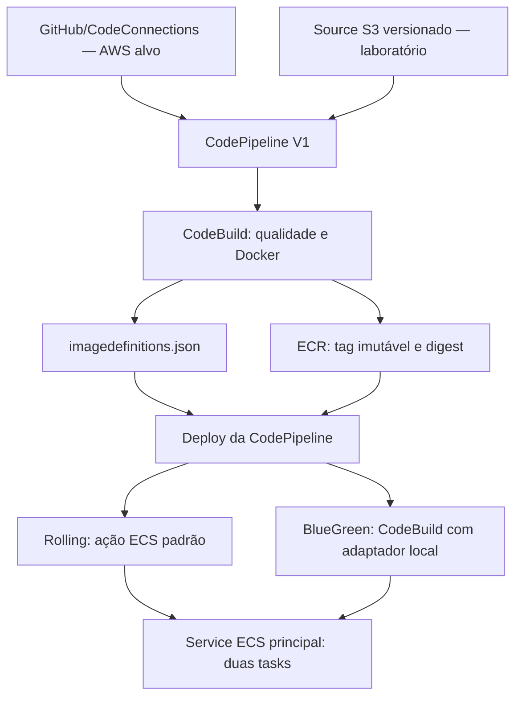
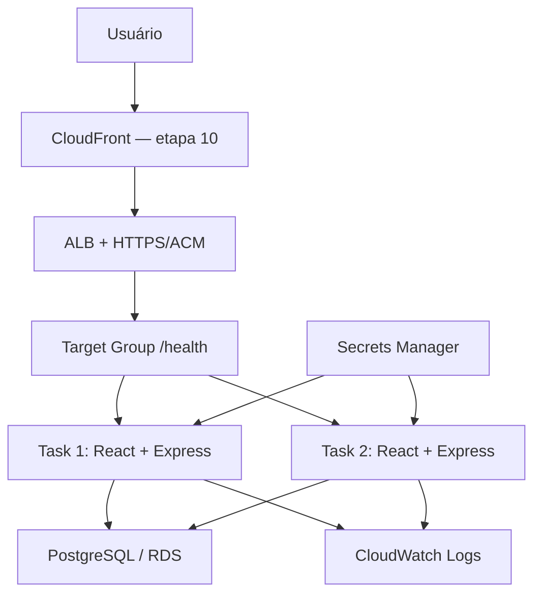

# Arquitetura AWS alvo e laboratório executável

CloudTasks representa uma arquitetura AWS/DevOps com LocalStack como ambiente de emulação. O laboratório não declara que há capacidade EC2 real ou toda a infraestrutura de produção implementada.

## Entrega

GitHub é a origem do portfólio. GitHub Actions valida o repositório. Na AWS alvo, CodeConnections alimenta a CodePipeline; localmente, o publisher fornece um snapshot S3 versionado. CodeBuild roda qualidade e Docker build/push, e o Deploy consome o artifact: ECS padrão no modo Rolling, ou CodeBuild com o adaptador explícito no modo BlueGreen.

Os dois Source nodes são alternativas de ambiente, não duas ações simultâneas. `create-cicd.ps1` configura e acompanha os serviços; não substitui sua execução com um deploy externo.

## Tráfego e dados

CloudFront ainda não está implementado; o acesso atual entra pelo ALB/gateway LocalStack. O React compilado é servido pelo Express no mesmo container. `GET /health` verifica o PostgreSQL; `/api/tasks` implementa CRUD com validação e SQL parametrizado.

## Rede e compute

Alvo: duas AZs e subnets públicas, aplicação privada e dados privados; ECS sobre capacidade EC2 real, task definition `bridge`, containerPort 3000, hostPort dinâmico. O ECS registra instância/hostPort no TG `instance`.

Laboratório: VPC/subnets/rotas no control plane emulado, tasks pelo executor Docker e conectividade na `cloudtasks-localstack-network`. Não existem container instances EC2 reais. `launchType=EC2` na API e `registeredContainerInstancesCount=0` não contradizem esse executor. O TG local é `ip`, com IP Docker/porta 3000 e sincronização após deploy.

Docker network não equivale ao isolamento físico de VPC/subnets/security groups. A capacidade EC2/ASG/bootstrap e o provisionamento produtivo AWS completo ainda precisariam ser concretizados se o portfólio migrar para AWS real. Isso não exige refazer a base local já comprovada para concluir CI/CD.

## TLS e segredos

No control plane, listener ALB HTTPS `:443` recebe ACM. No socket local compartilhado `:4566`, TLS é terminado pelo gateway LocalStack. Na AWS real, o ALB termina TLS com o certificado ACM associado.

A task definition referencia `cloudtasks/database` no Secrets Manager. `DATABASE_SECRET_JSON` é injetado em runtime; configuração e senha não entram no Source, imagem ou metadados de deploy. Consulte [SECURITY.md](../SECURITY.md) para limites da verificação e proteção dos logs.

## Estado, observabilidade e etapas

`PERSISTENCE=0` e bind por sessão permitem reconstruir recursos, sem restaurar snapshots antigos. Isso descarta dados locais e não representa durabilidade RDS da AWS real. O bind permanece necessário ao executor CodeBuild.

CloudWatch Logs básico já foi exercitado; métricas, alarmes e dashboard pertencem à etapa 11. A etapa 8 foi homologada no Windows/LocalStack e publicada com CI real do GitHub. A etapa atual é 9, Blue/Green: o adaptador local usa dois serviços independentes durante validação/bake e converge o principal 0→2 enquanto green atende. A homologação do controlador AWS nativo continua separada, pelas limitações observadas/documentadas do emulador. CloudFront (10), Amazon Q/MCP (12) e polimento (13) permanecem posteriores; consulte [BLUE-GREEN.md](BLUE-GREEN.md).

[PIPELINE.md](PIPELINE.md), [DECISIONS.md](DECISIONS.md), [ROADMAP.md](ROADMAP.md) e [AUDIT.md](AUDIT.md) registram decisões e evidências.

## Fronteira do adaptador Blue/Green

Durante promoção/bake, o TG principal e o TG temporário green continuam associados ao ALB por rotas de teste nos dois listeners. A ação padrão define produção; cabeçalhos de teste não são autenticação. Após validação e bake, green mantém tráfego durante a retirada controlada/recriação das duas tasks principais. Só após validar imagem, digest e HTTP/HTTPS finais são removidos recursos temporários e lock. [Fluxo completo](BLUE-GREEN.md).
