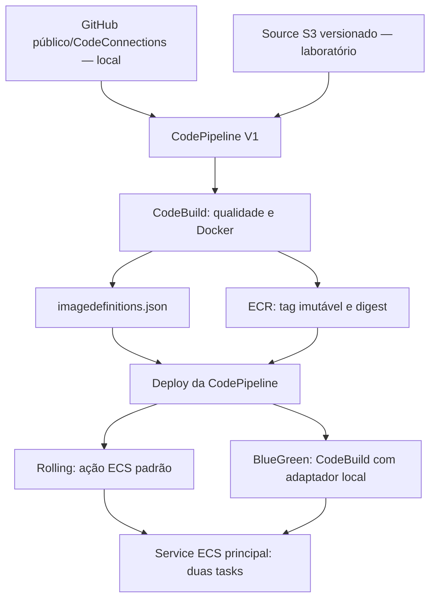
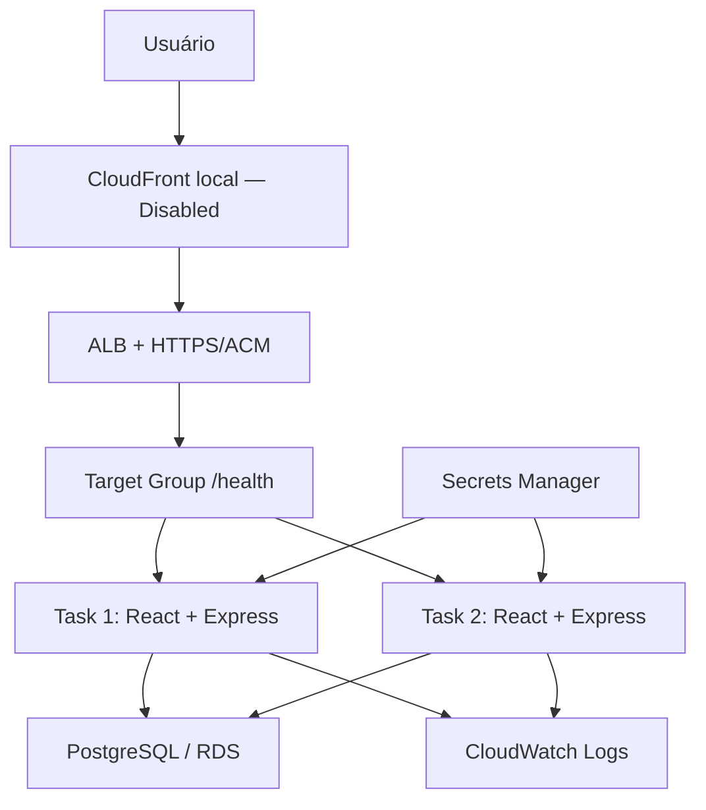

# Arquitetura de referência e projeto executável no LocalStack

O projeto deve reproduzir a aplicação e os componentes da referência BIA. A execução autorizada usa Docker/LocalStack Student/Pro, sem recursos pagos na AWS. Os serviços devem ser funcionais onde o emulador os suporta; configurações declaradas e comportamento executável são verificados separadamente. A [matriz V01-V12](REFERENCE-VIDEO.md) registra as diferenças e as provas, sem afirmar paridade AWS integral.

## Entrega

GitHub Actions valida o repositório. A pipeline da referência usa GitHub público/CodeConnections, CodeBuild e ação ECS padrão na CodePipeline emulada. O commit completo, a execução e os artifacts são conferidos; o aceite exige imagem/digest e réplicas físicas. O fluxo S3 versionado permanece disponível nos scripts anteriores, inclusive no modo BlueGreen adicional. [Operação GitHub e limites](GITHUB-PIPELINE.md).

Os dois Source nodes são pipelines separadas. `create-github-pipeline.ps1` configura a origem GitHub; `create-cicd.ps1` conserva o fluxo S3 anterior. A entrega da referência exige os três provedores nativos e a conferência do runtime físico.

## Tráfego e dados

CloudFront está configurado e o proxy pelo domínio gerado foi verificado com HTML/assets/CRUD. O estado final é Disabled, como na referência; cache, redirect e bloqueio de tráfego Disabled não são aplicados como na AWS. O acesso pelo navegador continua entrando pelo ALB/gateway LocalStack. [Configuração, provas e limites](CLOUDFRONT.md). O React compilado é servido pelo Express no mesmo container. `GET /health` verifica o PostgreSQL; `/api/tasks` implementa CRUD com validação e SQL parametrizado.

## Rede e compute

Alvo: duas AZs e subnets públicas, aplicação privada e dados privados; ECS sobre capacidade EC2 real, task definition `bridge`, containerPort 3000, hostPort dinâmico. O ECS registra instância/hostPort no TG `instance`.

Laboratório: VPC/subnets/rotas no control plane emulado, tasks pelo executor Docker e conectividade na `cloudtasks-localstack-network`. Não existem container instances EC2 reais. `launchType=EC2` na API e `registeredContainerInstancesCount=0` não contradizem esse executor. O TG local é `ip`, com IP Docker/porta 3000 e sincronização após deploy.

Docker network não equivale ao isolamento físico de VPC/subnets/security groups. Capacidade EC2, bootstrap e provisionamento AWS completo são requisitos pendentes da entrega final. A base local pode ser preservada e usada em testes; sua homologação de CI/CD não implementa esses requisitos.

## TLS e segredos

No control plane, listener ALB HTTPS `:443` recebe ACM. No socket local compartilhado `:4566`, TLS é terminado pelo gateway LocalStack. Na AWS real, o ALB termina TLS com o certificado ACM associado.

A task definition referencia `cloudtasks/database` no Secrets Manager. `DATABASE_SECRET_JSON` é injetado em runtime; configuração e senha não entram no Source, imagem ou metadados de deploy. Consulte [SECURITY.md](../SECURITY.md) para limites da verificação e proteção dos logs.

## Estado, observabilidade e etapas

`PERSISTENCE=0` e bind por sessão permitem reconstruir recursos, sem restaurar snapshots antigos. Isso descarta dados locais e não representa durabilidade RDS da AWS real. O bind permanece necessário ao executor CodeBuild.

CloudFront, métricas, alarmes, dashboard e os dois MCPs tiveram provas funcionais locais, repetidas após a parada de 10/10 às 17:27:52 UTC. O agente Q ainda depende de autenticação pessoal e chat. A pipeline GitHub/CodeBuild/ECS concluiu as ações nativas; seu aceite físico permanece pendente após timeout remoto. O adaptador [Blue/Green](BLUE-GREEN.md) tem provas anteriores separadas e não substitui a pipeline da referência. [Registro atual](EVIDENCE-SESSION-RESTART-20261010.json).

[PIPELINE.md](PIPELINE.md), [DECISIONS.md](DECISIONS.md), [ROADMAP.md](ROADMAP.md) e [AUDIT.md](AUDIT.md) registram decisões e evidências.

## Fronteira do adaptador Blue/Green

Durante promoção/bake, o TG principal e o TG temporário green continuam associados ao ALB por rotas de teste nos dois listeners. A ação padrão define produção; cabeçalhos de teste não são autenticação. Após validação e bake, green mantém tráfego durante a retirada controlada/recriação das duas tasks principais. Só após validar imagem, digest e HTTP/HTTPS finais são removidos recursos temporários e lock. [Fluxo completo](BLUE-GREEN.md).

## Aplicação e runtime verificados em 08/10/2026

A versão 1.8.2 implementa os elementos observáveis da BIA, com prazo textual compatível, prioridade editável e saúde real. [Evidências atuais](EVIDENCE-BIA-20261008.json) distinguem testes isolados, PostgreSQL compartilhado, browser pelo ALB e cada execução da pipeline.

O script solicita listener HTTP 80; o provider deste runtime reporta HTTP 4566. HTTPS aparece como listener lógico 443, com TLS efetivo no gateway 4566. Esses valores locais não reproduzem a terminação de tráfego HTTP 80/HTTPS 443 em um ALB AWS. A configuração CORS permite somente as duas origens desse ALB local.

## Histórico verificado antes da parada de 10/10 às 17:27 UTC

O banco anterior ao reinício foi recuperado de cópia física verificada, sem substituir dados por um banco vazio. Duas execuções nativas do adaptador Blue/Green passaram no mesmo container LocalStack, com o mesmo Source e imagens diferentes, sem reset. A segunda revisão tem duas tasks Docker saudáveis e foi verificada no PostgreSQL e no navegador. Essas provas encerram a retomada e o aceite local positivo dessa revisão, preservando as falhas históricas e a ausência de certificação do controlador AWS. [Evidência](EVIDENCE-REBOOT-20261010.json).

## Observabilidade e agente BIA

O monitor no Windows cruza as tasks físicas atuais com os targets do ALB, mede `/health` com banco e publica métricas customizadas, logs, dashboard e alarmes no CloudWatch emulado. O ensaio HTTP isolado comprovou OK → ALARM → OK por avaliação de dados, sem forçar estado de alarme nem interromper a BIA. [Operação](OBSERVABILITY.md).

Amazon Q 1.19.7 roda em container temporário separado com DNS externo normal para login. Por Docker stdio, chama os servidores oficiais ECS e PostgreSQL dentro do LocalStack. O ECS recebe endpoint local, chaves fictícias e escrita desabilitada; PostgreSQL usa role própria SELECT-only e segredo em runtime. Dependências ficam no filesystem Linux interno, evitando o atraso do bind mount Windows. O agente expõe somente duas ferramentas de leitura. Login Builder ID e chat autenticado são provas separadas dos testes MCP. [Operação e evidências](AMAZON-Q-MCP.md).

## Pipeline GitHub e recuperação após a parada

A execução nativa `d97f277d-b9c3-426f-86dc-afa8209b4874` recebeu o commit completo `48e5924fdd83a29cc3e1b91c22f2e94e605fb74e` e concluiu os três provedores. O aceite cruza as duas referências de Source, Git tree completo/ZIP, CodeBuild/artifact/recibo, imagem/digest ECR, duas réplicas físicas, targets, HTTPS e fingerprint SQL. artifactRevisions é validado quando fornecido; sua ausência no provider não fabrica uma revisão. A aplicação pós-deploy ainda aguarda essas verificações físicas. [Pipeline](GITHUB-PIPELINE.md).

A parada do mesmo container com PERSISTENCE=0 eliminou os estados nativos das APIs. O banco foi preservado antes da partida, extraído de uma cópia e restaurado antes do ECS. Os históricos anteriores são mantidos como provas anteriores; nenhuma execução foi recriada artificialmente no histórico vivo. [Recuperação](EVIDENCE-SESSION-RESTART-20261010.json).
