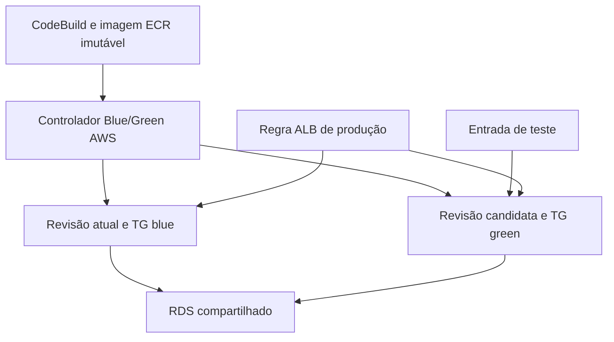

# Etapa 9 — Blue/Green: desenho e viabilidade

**Estado em 03/10/2026:** etapa 8 homologada; etapa 9 investigada e desenhada, sem troca de tráfego executada. O service existente, sua revisão 5, duas réplicas, banco, ALB e HTTPS continuam preservados.

## O que precisa ser demonstrado

Blue/Green mantém a versão atual atendendo produção enquanto uma nova revisão é criada e testada separadamente. Depois transfere o tráfego, conserva a versão anterior durante uma janela de observação e permite rollback de tráfego. Um update comum do service, dois registros de task set ou uma API que retorna Succeeded não bastam.

O critério vale para duas versões realmente executáveis, com identidade de imagem/digest verificável e requisições que comprovem qual versão respondeu.

## AWS alvo

Preferir o Blue/Green nativo do ECS para uma implementação AWS nova, conforme a recomendação atual da AWS. O service usa controlador ECS e estratégia BLUE_GREEN; os dois Target Groups, regras/listeners de produção e teste, role de infraestrutura, verificações e bake time precisam estar configurados.

Manter ECS sobre EC2, portas dinâmicas, RDS compartilhado, Secrets Manager, ECR imutável e CodePipeline/CodeBuild. Não trocar a rede para Fargate ou awsvpc apenas por conveniência de um exemplo. A combinação exata EC2/bridge/TG instance e a action da pipeline com a estratégia nativa ainda precisam de validação em AWS; esta entrega não a certifica.

Quando for necessário reproduzir o modelo CodeDeploy, a AWS possui uma integração CodePipeline CodeDeployToECS oficialmente documentada. Ela exige controlador CODE_DEPLOY, aplicação/deployment group CodeDeploy, dois Target Groups, listener de produção, listener de teste opcional, roles e artifacts task definition/AppSpec/imagem. É uma alternativa arquitetural distinta, não uma alteração aplicada nesta entrega.

O desenho recomendado é:

As duas ligações da regra de produção representam os destinos antes/depois da promoção. O desenho não afirma que ambos atendem produção permanentemente. Na arquitetura alvo os TGs são instance; no laboratório seriam ip, preservando a diferença já documentada.

Migrações precisam ser compatíveis com ambas as revisões durante a coexistência. Rollback da aplicação não restaura automaticamente dados escritos no RDS. O ALB/TLS, health com banco e segredos em runtime permanecem; CloudFront continua na etapa 10.

## Limites documentados do LocalStack

| Componente | Documentação oficial atual | Consequência para o aceite |
| --- | --- | --- |
| CodeDeploy | Operações atualmente mockadas | Status da API não prova implantação ou rollback reais. |
| CodePipeline CodeDeployToECS | Atualiza o service e aguarda estabilidade; não emula corretamente Blue/Green | Não usar a action para declarar troca real de tráfego. |
| ECS service deployments | ListServiceDeployments, DescribeServiceDeployments, DescribeServiceRevisions, ContinueServiceDeployment e StopServiceDeployment não implementadas na cobertura publicada | Não há paridade comprovada para observar/controlar o Blue/Green nativo. |
| Manual Approval na pipeline local | Action funciona como no-op | Não apresentar esse estágio como uma aprovação humana que bloqueia a promoção. |

Documentação consultada em 03/10/2026; cobertura e licenciamento podem mudar. Não é uma limitação da AWS real.

## Observação na máquina

LocalStack Pro 2026.8.3:02342ae2e, Windows PowerShell 5.1 e executor ECS Docker:

- DescribeServices: Desired 2, Running 2, Pending 0; task definition cloudtasks:5.
- DescribeTaskSets: exit 0 e cinco registros. Esses registros não demonstram Blue/Green.
- ListServiceDeployments: exit 255, InternalFailure, com nomes e com ARNs completos.
- A CLI reconheceu a operação. Não foi observada mensagem explícita de API não implementada nem HTTP 501.
- Nenhuma criação/update de service, task set, Target Group ou listener foi realizada.

Evidência sanitizada: [EVIDENCE-BLUE-GREEN.json](EVIDENCE-BLUE-GREEN.json). O exit 0 do script de inspeção significa apenas que coletou o diagnóstico; a consulta que falhou continua registrada como falha.

**Inferência:** a cobertura publicada e a investigação local não permitem homologar o controlador Blue/Green nativo neste ambiente. Não se concluiu que o service saudável está quebrado, nem que todas as operações de tráfego do ALB são inutilizáveis.

## Decisão para este laboratório

Preservar a pipeline ECS padrão da etapa 8. Não trocar para CodeDeployToECS só para obter um status Succeeded, não adicionar um controlador PowerShell próprio e não antecipar CloudFront.

Uma demonstração local alternativa poderia usar dois services e dois TGs, testar a candidata e alterar a regra ALB por API. Isso demonstraria coexistência, promoção e rollback manuais do laboratório, após provar cada comportamento. Não certificaria CodeDeploy nem Blue/Green nativo do ECS. Essa alternativa não foi implementada e precisaria de uma decisão explícita de escopo.

A validação nativa permanece pendente até haver suporte verificável do emulador ou um ambiente AWS autorizado. Nenhuma conta paga foi criada nem houve deploy AWS real.

## Critério objetivo de conclusão

1. A versão blue atende produção e a green executa uma imagem/digest diferente, sem remover blue.
2. A entrada de teste alcança green; produção continua em blue durante o teste.
3. Health/CRUD/RDS e identity check de green passam; candidata inválida não recebe produção.
4. O controlador nativo promove green; requisições comprovam a troca, além das APIs.
5. A versão anterior permanece disponível pelo bake time; rollback retorna efetivamente a produção a blue.
6. CodePipeline/CodeBuild, artifact, controlador e imagem são correlacionados à execução correta; sem fallback que transforme falha em aprovação.

Registrar separadamente falha de candidata, promoção, janela de observação e rollback. A etapa 9 não recebe marcação concluída apenas pelo desenho ou por uma demonstração manual parcial.

## Fontes oficiais

- [AWS ECS Blue/Green nativo](https://docs.aws.amazon.com/AmazonECS/latest/developerguide/deployment-type-blue-green.html).
- [AWS CodeDeploy Blue/Green e recomendação de ECS nativo](https://docs.aws.amazon.com/AmazonECS/latest/developerguide/deployment-type-bluegreen.html).
- [AWS action CodeDeployToECS](https://docs.aws.amazon.com/codepipeline/latest/userguide/action-reference-ECSbluegreen.html).
- [LocalStack CodeDeploy — limitações](https://docs.localstack.cloud/aws/services/codedeploy/#limitations).
- [LocalStack CodePipeline — actions e limitações](https://docs.localstack.cloud/aws/services/codepipeline/#actions).
- [LocalStack ECS — cobertura](https://docs.localstack.cloud/aws/services/ecs/#api-coverage).
