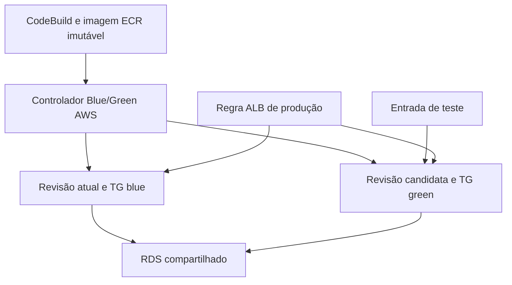

# Etapa 9 — Blue/Green: desenho e viabilidade

**Estado em 03/10/2026, versão 1.7.6:** etapa 8 homologada. A prova temporária da etapa 9 demonstrou coexistência, rota de teste, promoção e rollback manuais em um ALB isolado. O controlador nativo e a integração CI/CD Blue/Green continuam pendentes. O service existente, revisão 5, duas réplicas, banco, ALB e HTTPS foram preservados.

## O que precisa ser demonstrado

Blue/Green mantém a versão atual atendendo produção enquanto uma nova revisão é criada e testada separadamente. Depois transfere o tráfego, conserva a versão anterior durante uma janela de observação e permite rollback de tráfego. Um update comum do service, dois registros de task set ou uma API que retorna Succeeded não bastam.

O critério vale para duas versões realmente executáveis, com identidade de imagem/digest verificável e requisições que comprovem qual versão respondeu.

## AWS alvo

Preferir o Blue/Green nativo do ECS para uma implementação AWS nova, conforme a recomendação atual da AWS. O service usa controlador ECS e estratégia BLUE_GREEN; os dois Target Groups, regras/listeners de produção e teste, role de infraestrutura, verificações e bake time precisam estar configurados.

Manter ECS sobre EC2, portas dinâmicas, RDS compartilhado, Secrets Manager, ECR imutável e CodePipeline/CodeBuild. Não trocar a rede para Fargate ou awsvpc apenas por conveniência de um exemplo. A combinação exata EC2/bridge/TG instance e a action da pipeline com a estratégia nativa ainda precisam de validação em AWS; esta entrega não a certifica.

Quando for necessário reproduzir o modelo CodeDeploy, a AWS possui uma integração CodePipeline CodeDeployToECS oficialmente documentada. Ela exige controlador CODE_DEPLOY, aplicação/deployment group CodeDeploy, dois Target Groups, listener de produção, listener de teste opcional, roles e artifacts task definition/AppSpec/imagem. É uma alternativa arquitetural distinta, não uma alteração aplicada nesta entrega.

O desenho recomendado é:

As duas ligações da regra de produção representam os destinos antes/depois da promoção. O desenho não afirma que ambos atendem produção permanentemente. Na arquitetura alvo os TGs são instance; no laboratório seriam ip, preservando a diferença já documentada.

Migrações precisam ser compatíveis com ambas as revisões durante a coexistência. Rollback da aplicação não restaura automaticamente dados escritos no RDS. O ALB/TLS, health com banco e segredos em runtime permanecem; CloudFront continua na etapa 10.

## Limites documentados do LocalStack

| Componente | Documentação oficial atual | Consequência para o aceite |
| --- | --- | --- |
| CodeDeploy | Operações atualmente mockadas | Status da API não prova implantação ou rollback reais. |
| CodePipeline CodeDeployToECS | Atualiza o service e aguarda estabilidade; não emula corretamente Blue/Green | Não usar a action para declarar troca real de tráfego. |
| ECS service deployments | ListServiceDeployments, DescribeServiceDeployments, DescribeServiceRevisions, ContinueServiceDeployment e StopServiceDeployment não implementadas na cobertura publicada | Não há paridade comprovada para observar/controlar o Blue/Green nativo. |
| Manual Approval na pipeline local | Action funciona como no-op | Não apresentar esse estágio como uma aprovação humana que bloqueia a promoção. |

Documentação consultada em 03/10/2026; cobertura e licenciamento podem mudar. Não é uma limitação da AWS real.

## Investigação inicial de leitura na máquina

LocalStack Pro 2026.8.3:02342ae2e, Windows PowerShell 5.1 e executor ECS Docker:

- DescribeServices: Desired 2, Running 2, Pending 0; task definition cloudtasks:5.
- DescribeTaskSets: exit 0 e cinco registros. Esses registros não demonstram Blue/Green.
- ListServiceDeployments: exit 255, InternalFailure, com nomes e com ARNs completos.
- A CLI reconheceu a operação. Não foi observada mensagem explícita de API não implementada nem HTTP 501.
- Nessa investigação inicial de leitura, nenhuma criação/update de service, task set, Target Group ou listener foi realizada. A prova manual posterior criou somente fixtures isoladas, descritas abaixo.

Evidência sanitizada: [EVIDENCE-BLUE-GREEN.json](EVIDENCE-BLUE-GREEN.json). O exit 0 do script de inspeção significa apenas que coletou o diagnóstico; a consulta que falhou continua registrada como falha.

**Inferência:** a cobertura publicada e a investigação local não permitem homologar o controlador Blue/Green nativo neste ambiente. Não se concluiu que o service saudável está quebrado, nem que todas as operações de tráfego do ALB são inutilizáveis.

## Prova temporária de tráfego executada

O teste usou dois targets blue do service saudável e **uma task ECS independente** como candidata green. Criou um ALB e dois TGs temporários, com nomes exclusivos `ct-bg-probe-*`; não criou outro service nem atualizou o service/listeners/TG de produção. Reutilizou duas imagens previamente entregues pela pipeline nativa. A candidata usou a imagem da revisão 3; essa revisão antiga representa uma segunda versão para a prova, não uma nova release a promover em produção.

| Identidade observada | Blue atual | Green candidata |
| --- | --- | --- |
| Imagem ECR | `pipeline-e4effff0-544f-4070-bc01-0c4239db7fe8` | `pipeline-6628a386-8091-408b-a9d6-3a06164a0a27` |
| Digest ECR/Docker | `sha256:54c00b84…` | `sha256:229cf310…` |
| Bundle servido | `/assets/index-BjgdmimE.js` | `/assets/index-Cvukn_hy.js` |
| SHA256 do bundle | `351a4c89…` | `fb70df53…` |

Valores completos, ARNs, task/container IDs e checks: [EVIDENCE-BLUE-GREEN-TRAFFIC.json](EVIDENCE-BLUE-GREEN-TRAFFIC.json). O digest foi verificado no conteúdo físico da imagem Docker, não apenas na URI configurada. O hash do bundle servido comprova qual frontend respondeu; não foi adicionado endpoint ou texto operacional à aplicação.

Procedimento e resultado observados:

1. Conferir produção 2/2, sem pending, mesmos task ARNs, Docker healthy, digest, listeners, TG e HTTPS com `status=ok`/`database=ok`.
2. Registrar uma definição **temporária** da imagem green, preservando bridge, Secrets Manager por referência e configuração da aplicação; usar `hostPort=0` para a nova task. Criar ALB/TGs isolados e registrar os targets.
3. Usar um único listener HTTP: a ação padrão encaminha a blue; uma regra `http-header`, `X-CloudTasks-Probe: green`, alcança green. Evita o limite documentado de múltiplos listeners do mesmo esquema na porta compartilhada do gateway, sem mudar portas ou reiniciar LocalStack. Essa regra é uma rota de teste do laboratório, não controle de acesso.
4. Conferir `/health`, banco, `GET /api/tasks` e identidade do bundle em acesso direto à candidata e nas duas rotas. Três repetições confirmaram isolamento.
5. Retirar o target green. A API mostrou zero targets. O HTTP retornou 200, mas o payload não confirmou `status=ok` e `database=ok`; a mesma verificação de aplicação usada antes da promoção rejeitou a rota com `APP_DATABASE_HEALTH`. A ação padrão ficou em blue, que seguiu saudável. A candidata inválida **não foi promovida**.
6. Registrar novamente green e exigir target healthy, health de aplicação/banco e bundle correto. Alterar somente a ação padrão do listener temporário para green: três verificações confirmaram seu bundle. A produção real do laboratório continuou em blue.
7. Retornar a ação padrão temporária a blue: três verificações confirmaram o bundle original. Green ainda estava disponível pela rota de teste. Apagar o ALB/TGs temporários, parar a task candidata e desregistrar sua definição. Conferir novamente produção: mesmas tasks, containers, revisão, listeners, dois targets healthy e HTTPS; nenhuma falha de cleanup.

As primeiras tentativas reprovadas também estão resumidas na evidência; não foram convertidas em sucesso. O resultado final `TRAFFIC_PROBE_PASSED` cobre a prova manual descrita. **A paridade HTTP 503 para TG vazio não passou**, e o controlador nativo não foi usado.

### Dois achados de emulação

**Porta na definição:** `RunTask` da revisão 3 retornou zero tasks e seis falhas `RESOURCE:PORTS`. `DescribeTaskDefinition` mostrava `hostPort=19025`. Na prova isolada foi possível registrar uma definição com `hostPort=0`, iniciar sua task sem falhas e depois observar a própria API devolver `hostPort=46538` nessa definição. Essa mudança foi observada antes/depois; não é uma característica da AWS real. A AWS documenta alocação dinâmica em bridge e os bindings efetivos em `DescribeTasks`. Não modificar as definições de produção nem copiar cegamente portas resolvidas do emulador para um ambiente paralelo.

**TG vazio:** a documentação AWS associa ausência de targets a HTTP 503. No teste local, a rota com TG vazio retornou 200 com health de aplicação inválido. A origem exata desse payload no provider não foi determinada; não afirmar que veio da aplicação ou que esse comportamento é da AWS. A validação semântica e de identidade recusou a candidata. Não enfraquecer checks para aceitar o status HTTP sozinho.

Registros de container instances encontrados no control plane do emulador também não comprovam hosts EC2 reais. A identidade executável foi verificada nos containers Docker.

### Limites dessa prova

Não houve novo CodeBuild/CodePipeline, promoção de produção, duas novas réplicas green, teste de escrita CRUD entre revisões, migração de schema, bake time automático, alarme ou rollback por controlador AWS. A observação foi breve, por requisições, e não substitui uma janela configurada. Tasks paradas e definições desregistradas podem continuar como registros históricos na API; os fixtures ativos foram limpos. HTTPS foi conferido no caminho de produção existente; o ALB temporário usou HTTP dentro do laboratório.

O operador descartável ficou fora do projeto, Source S3, contexto Docker e ZIP. A entrega incorpora documentação e evidências sanitizadas, não esse operador como infraestrutura de CI/CD. O teste demonstra viabilidade do tráfego, mas ainda não oferece um comando de deploy Blue/Green repetível no repositório.

## Decisão para este laboratório

Preservar a pipeline ECS padrão da etapa 8. Não trocar para CodeDeployToECS só para obter um status Succeeded, não adicionar um controlador PowerShell próprio e não antecipar CloudFront.

A alternativa manual foi verificada como prova temporária, usando uma task independente para reduzir escopo e risco. A decisão desta entrega é preservar esse resultado como evidência de tráfego e manter a pipeline padrão da etapa 8. Não incorporar um controlador próprio para simular uma certificação que o fornecedor não oferece. Uma implementação permanente exige resolver o suporte nativo e seus critérios abaixo; a prova temporária não o substitui.

A validação nativa permanece pendente até haver suporte verificável do emulador ou um ambiente AWS autorizado. Nenhuma conta paga foi criada nem houve deploy AWS real.

## Critério objetivo de conclusão da etapa 9 nativa

1. A versão blue atende produção e a green executa uma imagem/digest diferente, sem remover blue.
2. A entrada de teste alcança green; produção continua em blue durante o teste.
3. Health/CRUD/RDS e identity check de green passam; candidata inválida não recebe produção.
4. O controlador nativo promove green; requisições comprovam a troca, além das APIs.
5. A versão anterior permanece disponível pelo bake time; rollback retorna efetivamente a produção a blue.
6. CodePipeline/CodeBuild, artifact, controlador e imagem são correlacionados à execução correta; sem fallback que transforme falha em aprovação.

Registrar separadamente falha de candidata, promoção, janela de observação e rollback. A etapa 9 não recebe marcação concluída apenas pelo desenho ou por uma demonstração manual parcial.

## Fontes oficiais

- [AWS ECS Blue/Green nativo](https://docs.aws.amazon.com/AmazonECS/latest/developerguide/deployment-type-blue-green.html).
- [AWS CodeDeploy Blue/Green e recomendação de ECS nativo](https://docs.aws.amazon.com/AmazonECS/latest/developerguide/deployment-type-bluegreen.html).
- [AWS action CodeDeployToECS](https://docs.aws.amazon.com/codepipeline/latest/userguide/action-reference-ECSbluegreen.html).
- [LocalStack CodeDeploy — limitações](https://docs.localstack.cloud/aws/services/codedeploy/#limitations).
- [LocalStack CodePipeline — actions e limitações](https://docs.localstack.cloud/aws/services/codepipeline/#actions).
- [LocalStack ECS — cobertura](https://docs.localstack.cloud/aws/services/ecs/#api-coverage).

- [LocalStack ELB — porta compartilhada e cobertura](https://docs.localstack.cloud/aws/services/elb/).
- [AWS PortMapping — bridge, hostPort dinâmico e bindings](https://docs.aws.amazon.com/AmazonECS/latest/APIReference/API_PortMapping.html).
- [AWS ALB — ausência de targets e HTTP 503](https://docs.aws.amazon.com/elasticloadbalancing/latest/application/load-balancer-troubleshooting.html#http-503-issues).
