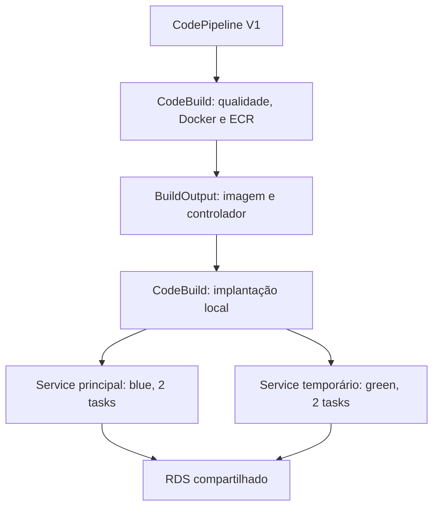

# Etapa 9 — Blue/Green no laboratório

Estado da versão 1.8.0: **BLUE/GREEN LOCAL POR ADAPTADOR VALIDADO**. O modo executável é `LocalStackBlueGreenAdapter`; a homologação do controlador Blue/Green nativo da AWS continua separada e não é reivindicada. Evidências anteriores de tráfego e de reprovação do emulador são históricas, não aprovações desta implementação.

## Decisão e arquitetura

O laboratório usa a CodePipeline V1 e dois projetos CodeBuild: um executa qualidade, Docker build e push ECR; o outro executa o controlador de implantação sobre as APIs ECS/ELB. A pipeline recebe Source S3 versionado, transporta os artifacts e registra as ações. Nenhum build ou deploy externo é iniciado como fallback para transformar uma ação nativa falha em sucesso.

O modo padrão de `create-cicd.ps1` continua `Rolling`, com a ação ECS padrão da etapa 8. `-DeploymentMode BlueGreen` seleciona explicitamente o adaptador local. Na AWS alvo, usar o controlador ECS Blue/Green ou a integração CodeDeploy oficialmente suportada; o adaptador não deve ser transportado como substituto de um controlador AWS.



Os dois serviços coexistem durante validação, promoção e observação. Após a janela aprovada, o adaptador atualiza o serviço/TG principal para a imagem aceita por uma transição verificada de 0 para 2 réplicas enquanto green atende produção, valida suas duas novas tasks e restaura os destinos padrão originais. Só então remove o serviço/TG/regras green e os containers blue aposentados. Essa convergência final preserva os nomes e os scripts existentes do projeto; não é o mecanismo interno do Blue/Green AWS.

ECS/EC2 com `bridge`, portas dinâmicas e TG `instance` permanecem a arquitetura alvo. No laboratório as tasks são containers Docker, os TGs são `ip` e o gateway LocalStack termina TLS em `:4566`; `launchType=EC2` não comprova hosts EC2 reais. VPC, RDS, Secrets, ALB, listener/ACM, UI e CRUD existentes são preservados.

## Tráfego e ordem das operações

Cada listener HTTP/HTTPS mantém duas regras temporárias por cabeçalho:

| Destino | Prioridade | Cabeçalho `X-CloudTasks-Candidate` |
| --- | --- | --- |
| TG green temporário | 49310 | UUID da execução CodePipeline |
| TG principal blue | 49311 | `blue-` seguido do mesmo UUID |

São rotas de teste em um laboratório privado, não autenticação ou controle de acesso. Prioridades ocupadas são recusadas antes de criar a candidata. Sem o cabeçalho, a ação padrão encaminha a produção.

1. Conferir serviço principal 2/2/0, task definition, digest ECR/Docker, containers físicos healthy, aplicação/banco e identidade HTTP/HTTPS.
2. Criar definição, serviço e TG exclusivos da execução; exigir duas candidatas healthy e sua imagem/digest/release exatos. Preservar Secrets Manager por referência; resetar `hostPort=0` ao copiar a definição observada do emulador.
3. Comprovar produção em blue e rota de teste em green por HTTP e HTTPS. Criar uma tarefa em blue, lê-la em green, atualizá-la em green e conferir em blue; apagar somente essa tarefa de teste.
4. Promover a ação padrão dos dois listeners a green. Manter **ambos os TGs associados ao ALB**, incluindo as regras de blue.
5. Observar por pelo menos 60 segundos, com duas réplicas de cada versão. Cada amostra exige os mesmos containers blue originais, green saudável, resposta blue pela rota retida HTTP/HTTPS e release green na produção. O certificado TLS é verificado pelo SHA256 da sessão, sem desativar globalmente a validação.
6. Após o bake, verificar as duas tasks green, encaminhar explicitamente os dois destinos padrão à candidata e conferir as ações pela API, além das identidades HTTP/HTTPS. A identidade da imagem sozinha não distingue uma candidata de um principal que já convergiu. Escalar o serviço principal para zero, recapturar tasks em encerramento e exigir duas amostras vazias nas APIs e no Docker; só então iniciar duas tasks da nova revisão. Verificar green novamente durante essa transição. Registrar os novos IPs no TG principal, exigir 2/2 healthy e devolver os destinos padrão ao TG principal. Verificar HTTP/HTTPS da imagem aceita antes da limpeza.
7. Inventariar regras por listener, prioridade, cabeçalho exclusivo da execução e TG esperado para recuperar uma criação cuja resposta se perdeu. Remover somente recursos temporários pertencentes à execução e verificar sua ausência por API e Docker. Recapturar tasks após desiredCount=0 evita omitir uma startup que termine durante a retirada do serviço.

Uma requisição HTTP 200 isolada não aprova health: `status=ok`, `database=ok`, CRUD e identidade são exigidos. `/release.json` é um artifact público da imagem com UUID do build, sem segredo ou mudança visual na UI; o bundle servido também é conferido. A imagem anterior sem esse artifact só pode ser reconhecida pela identidade legacy estritamente verificada; novas candidatas sempre precisam do release correto.

## Causa-raiz de `Target.NotInUse`

A tentativa `f098d443-00dc-4753-a474-201558996a56` passou validação, CRUD, promoção e 61,117 segundos de bake, mas falhou na convergência. O código retirava a última referência ao TG principal ao promover a ação padrão para green. Depois esperava esse TG ficar healthy antes de reassociá-lo. A API mostrou `unused / Target.NotInUse`; as tasks Docker estavam saudáveis. O rollback repetia a mesma ordem incorreta.

A AWS documenta `Target.NotInUse` quando o grupo não está associado a um load balancer ou sua AZ não está habilitada. Na execução investigada, reassociar o TG principal primeiro o tornou 2/2 healthy e permitiu restaurar HTTP/HTTPS. A correção mantém a rota retida blue nos dois listeners até a convergência ou rollback terminar. Não alterou o deregistration delay do TG principal.

A recuperação administrativa restaurou a imagem anterior em duas tasks saudáveis e removeu somente os recursos registrados. A tentativa e seu recibo continuam falhos; a recuperação não os aprova. Os containers blue originais já tinham sido aposentados após o bake e **não** são apresentados como preservados nessa tentativa. Identidades atuais foram preservadas durante a recuperação.

## Convergência sem rolling adicional no emulador

A tentativa posterior `971787fb-1a4d-41d8-9564-4cb2ed19a537` passou o isolamento e 70,581 segundos de bake. O UpdateService da convergência e depois do rollback deixaram **três containers físicos saudáveis da mesma revisão** para desiredCount=2. A validação recusou o estado, reteve green e o lock e não escreveu sucesso. Esse comportamento foi observado no executor testado; sua causa interna não foi atribuída sem acesso ao código proprietário.

O adaptador deixa de sobrepor outro rolling update ao Blue/Green. Depois do bake, green atende produção independentemente. O serviço principal é esvaziado, com ownership das tasks, recaptura de startups, contadores e Docker conferidos em duas amostras, e volta com exatamente duas tasks da imagem aceita. Os nomes do serviço, TG, cluster e configuração permanecem. O rollback depois de iniciar convergência primeiro restabelece e confere os dois destinos padrão em green, mesmo se o principal já responde à mesma imagem. Só então usa a mesma fronteira antes de restaurar a imagem anterior. A flag de alteração do principal é definida imediatamente antes da primeira requisição mutante, cobrindo uma resposta perdida; falha anterior restaura blue sem depender da candidata. Falhar nessa fronteira mantém o candidato que atende e exige recuperação; não remove uma task arbitrária para fazer o contador parecer aprovado.

A recuperação administrativa dessa tentativa foi registrada separadamente; a pipeline e o recibo falhos permanecem sem aprovação. Não é um reset do LocalStack, RDS, ECS ou pipeline.

## Identidade, bloqueio e recibo

`BuildOutput` contém `imagedefinitions.json`, os dois módulos do controlador e `buildspec.bluegreen.localstack.yml`. O deploy consome esse artifact exato, sem segundo Source ambíguo. O Source permanece selecionado por allowlist, com VersionId retornado pelo upload e SHA256.

O adaptador verifica a execução nativa ativa, a ação de imagem/build vinculada e sua localização S3 antes de adquirir o lock. O UUID zerado de `CODEBUILD_BUILD_ID` injetado pelo agente local é apenas informativo. O aceite consulta o **CodeBuild de deploy vinculado à ação**, `SUCCEEDED`, e exige a mesma localização do `DeployOutput` na ação e na API, além do hash do artifact. Não seleciona o último build para certificar uma execução.

O lock S3 `cloudtasks/blue-green/deploy.lock` usa `If-None-Match: *`. O proprietário é o UUID exato da execução; não há desbloqueio por idade. Ele complementa o lock de processo e a recusa de pipeline ativa, pois o LocalStack não emula todos os stage locks. Uma segunda aquisição foi efetivamente recusada com `PreconditionFailed`, sem alterar o proprietário.

O recibo possui fases, identidades físicas, isolamento, CRUD, promoção, amostras, imagem/revisão final e cleanup. O aceite também exige `final.canonicalRetirement`: pelo menos duas amostras vazias, zero containers canônicos em execução e produção HTTP/HTTPS na candidata durante a fronteira. O `DeployOutput` nativo transporta `deployment-receipt.json`; também há journal S3 por execução para diagnóstico. `SUCCEEDED` só é aceito com todas as ações nativas, os dois CodeBuilds corretos e as verificações completas de `test-cicd.ps1`.

## Falhas e rollback

| Situação | Resultado obrigatório |
| --- | --- |
| Candidata não saudável ou identidade errada | Não promover; blue continua nas mesmas tasks; recibo `REJECTED`, deploy/pipeline falhos. |
| Falha após iniciar troca de listener ou durante bake | Restaurar ambos os destinos e validar blue antes de limpar; recibo `ROLLED_BACK`, deploy/pipeline continuam falhos. |
| Falha durante convergência final | Manter green atendendo até restaurar e validar a imagem anterior no serviço principal; tarefas originais podem já ter sido aposentadas. |
| Rollback, journal ou limpeza incompletos | `RECOVERY_REQUIRED`, lock e recursos que atendem preservados; nenhuma metadata de sucesso nova. |

O rollback do adaptador é uma operação real de tráfego/revisão dentro do CodeBuild de deploy. Não é rollback nativo da CodePipeline ou CodeDeploy mockado. Migrações de banco precisam ser compatíveis entre versões; rollback de imagem não reverte dados RDS. Esta entrega não altera schema, não testa migrações destrutivas e não adiciona alarmes da etapa 11.

As restaurações HTTP e HTTPS são tentadas independentemente e conferidas pela API. Uma restauração incompleta mantém o erro e a proteção dos recursos. Cada probe HTTP tem limite total de oito segundos, rejeita body interrompido/erro/close incompleto e libera seu timer ao terminar; uma conexão interrompida não pode travar a implantação sem journal/rollback.

Um lock `RECOVERY_REQUIRED` exige diagnóstico e recuperação direcionada dos recursos registrados, com nova conferência física/HTTP/HTTPS antes de liberar o proprietário exato. Não apagar o lock às cegas nem resetar a sessão saudável. Operadores administrativos descartáveis da investigação não integram o projeto, Source, imagem ou ZIP.

## Executar na sessão saudável

```powershell
Set-ExecutionPolicy -Scope Process -ExecutionPolicy Bypass
& {
    $ErrorActionPreference = 'Stop'
    .\scripts\localstack\create-cicd.ps1 -DeploymentMode BlueGreen
    .\scripts\localstack\test-cicd.ps1
}
```

Esperado: `SourceSnapshot`, `BuildAndPush` e `DeployBlueGreen` Succeeded; os dois CodeBuilds SUCCEEDED; novas imagens/revisão; bake mínimo de 60 segundos e limpeza; serviço principal 2/2/0, TG 2/2 healthy, HTTPS e CRUD/RDS. O segundo comando não é executado pelo bloco se o primeiro falhar.

Controles negativos, executados separadamente:

```powershell
.\scripts\localstack\create-cicd.ps1 -DeploymentMode BlueGreen -BlueGreenScenario RejectCandidate
.\scripts\localstack\create-cicd.ps1 -DeploymentMode BlueGreen -BlueGreenScenario Rollback
```

Esses comandos **devem falhar** na pipeline/deploy. `RejectCandidate` força saída 42 na candidata; `Rollback` injeta falha controlada depois da promoção verificada. A evidência precisa comprovar, respectivamente, ausência de promoção e retorno real a blue com as mesmas identidades, cleanup e lock ausente. Falha de Source/download/build não comprova o cenário. Não usar metadata de um deploy anterior para aprovar a tentativa negativa.

Para a etapa 8 padrão, omitir `-DeploymentMode BlueGreen` mantém Rolling; isso pode alterar a declaração da pipeline. O emulador já perdeu consulta de execução histórica após mudança de versão: registrar evidências antes de alternar o modo. Declarações idênticas não são atualizadas desnecessariamente.

## Resultado executado em 04/10/2026

| Prova | Execução CodePipeline | Resultado |
| --- | --- | --- |
| Positiva 1, convergência 0→2 | `3da7a16d-8987-4cbf-949e-99719808b810` | Todas as ações e os dois CodeBuilds aprovados; bake 72,529 s; test-cicd HTTPS/CRUD/digest aprovado. |
| Positiva 2 consecutiva | `7a77b36e-d308-437f-9bdf-72844efd4bc1` | Todas as ações e os dois CodeBuilds aprovados; bake 76,115 s; nova imagem/revisão e test-cicd aprovado. |
| RejectCandidate | `658bbdc4-b19f-4f55-8e5a-13eb64bfb2dd` | Pipeline/deploy falhos; candidata rejeitada antes da promoção; blue original e metadata saudável preservadas. |
| Rollback após promoção | `de4b471a-f7e9-4289-b524-3a4a6ff1013a` | Green recebeu HTTP/HTTPS; falha controlada restaurou blue com os mesmos containers; pipeline/deploy continuam falhos. |

As positivas usaram Source SHA256 `d506efc6ccd84768e066e7ca2a85c69787e645de1215eba5f7b9ca1229fc4288`, VersionIds distintos e imagens/digests/revisões distintos, sem intervenção administrativa entre elas. O processo Windows terminou exit 0; cada entrega executou `test-cicd.ps1`. Ambos os recibos comprovam zero runtime canônico em duas amostras enquanto green atende, final 2/2 e cleanup completo/lock ausente.

Os controles negativos foram executados **antes do refinamento da convergência 0→2**, com Source SHA distinto. Seus caminhos de validação, promoção/bake e cleanup anterior à convergência foram conferidos idênticos; os cenários não entram na convergência. A evidência distingue essa ordem e não os apresenta como novas execuções do Source refinado. Essas provas anteriores à revisão final permanecem históricas. A suite após as correções da revisão tem 31 testes Node e 56 regressões PowerShell aprovados; os novos ciclos nativos são registrados separadamente no JSON de evidências. As tentativas falhas e suas recuperações permanecem separadas.

## Critério de conclusão local

- Duas execuções positivas distintas, com Source, build da imagem, deploy CodeBuild, artifacts e recibos correlacionados pelas APIs nativas.
- Coexistência física 2 blue + 2 green, isolamento, CRUD entre revisões, promoção HTTP/HTTPS e bake de pelo menos 60 segundos.
- Rejeição de candidata inválida sem tocar blue e rollback controlado após promoção, ambos com execução nativa falha e recuperação comprovada.
- Convergência para o serviço/TG principal 2/2 healthy, digest aceito e remoção de recursos temporários/lock.
- Código e evidências sanitizadas, sem token/senha no Git, Source, imagem, logs exibidos ou pacote.

Cumprir esses critérios conclui o **Blue/Green do laboratório por adaptador**, sem certificar um controlador AWS que não foi executado. CloudFront (10), observabilidade ampliada (11) e Amazon Q/MCP (12) continuam posteriores.

## Limites do fornecedor e testes anteriores

**Documentado:** CodeDeploy é mockado; a action CodeDeployToECS local só atualiza o service/aguarda estabilidade e não emula corretamente Blue/Green. V2, stage locks/retry/rollback e manual approval possuem limitações. `StopBuild` não está implementado; abandonar uma pipeline não preempta a thread do emulador.

**Observado:** em 2026.8.3 e 2026.9.0, o ECS nativo aceitou a configuração BLUE_GREEN, mas não manteve a blue/revisão candidata isoladas como exigido. Os controles bridge/IP e awsvpc/IP perderam blue diante de candidata inválida. Um ensaio EXTERNAL aceitou o task set `STEADY_STATE`, mas criou zero tasks executáveis durante 65 segundos. Nenhuma dessas APIs foi aprovada pelo status de metadata.

**Inferência:** duas instâncias independentes do serviço isolam o ciclo de vida das revisões no executor testado e permitem demonstrar o comportamento real de tráfego. Isso não prova defeito de toda versão futura, nem limitação AWS. A combinação AWS alvo ECS/EC2 + bridge + TG instance ainda requer implantação AWS autorizada; não houve conta paga ou deploy AWS nesta entrega.

Evidências históricas: [investigação de leitura](EVIDENCE-BLUE-GREEN.json), [tráfego manual](EVIDENCE-BLUE-GREEN-TRAFFIC.json), [controlador nativo reprovado](EVIDENCE-BLUE-GREEN-NATIVE.json). Os resultados atuais estão em [EVIDENCE-BLUE-GREEN-ADAPTER.json](EVIDENCE-BLUE-GREEN-ADAPTER.json).

## Referências oficiais consultadas em 04/10/2026

- [AWS ECS Blue/Green](https://docs.aws.amazon.com/AmazonECS/latest/developerguide/deployment-type-blue-green.html) e [recursos ALB](https://docs.aws.amazon.com/AmazonECS/latest/developerguide/alb-resources-for-blue-green.html).
- [AWS target health e Target.NotInUse](https://docs.aws.amazon.com/elasticloadbalancing/latest/application/check-target-health.html).
- [AWS CodePipeline CodeDeployToECS](https://docs.aws.amazon.com/codepipeline/latest/userguide/action-reference-ECSbluegreen.html).
- [AWS external controller](https://docs.aws.amazon.com/AmazonECS/latest/developerguide/deployment-type-external.html).
- [LocalStack CodePipeline](https://docs.localstack.cloud/aws/services/codepipeline/), [CodeBuild](https://docs.localstack.cloud/aws/services/codebuild/), [CodeDeploy](https://docs.localstack.cloud/aws/services/codedeploy/) e [ECS](https://docs.localstack.cloud/aws/services/ecs/).
